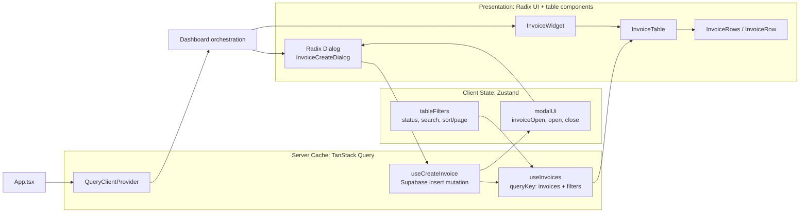

# Dashboard Modernization Implementation Plan

Status: Research only. No application code has been changed.

Source: `src/pages/Dashboard.tsx`

## Architecture Diagram

## Current Findings

- `Dashboard` owns theme, profile, four loading flags, invoices, analytics, notifications, modal visibility, and invoice form data.
- Four `useEffect(..., [])` blocks fetch profile, invoices, analytics, and notifications through raw Supabase calls.
- `Dashboard -> MainContainer -> ContentArea -> WidgetGrid -> InvoiceWidget -> InvoiceList -> InvoiceItem` forwards most data as untyped props.
- The modal is a large inline JSX block in `Dashboard`; it closes over `formData`, `theme`, and `handleCreateInvoice`.
- `InvoiceItem.localHover` is written but never read. `loadingProfile`, `notifications`, and `loadingNotifications` are effectively unused in the rendered UI.
- The current create handler only prepends a local invoice. It does not persist to Supabase despite the modal copy claiming that it does.

## Stale Closure and Lifecycle Risks

| Location | Risk | Planned correction |
| --- | --- | --- |
| `handleCreateInvoice` | Captures `invoices` and uses `invoices.length + 1` for IDs; rapid updates or refetches can lose rows or collide. | Move persistence to `useCreateInvoice`; let the server/database own identity; invalidate or update the invoices query on success. |
| `handleCreateInvoice` | Captures `formData` and is marked `async` without an awaited operation or mutation lifecycle. | Keep form values local to the dialog and pass a validated payload to the mutation. |
| Form `onChange` handlers | Object-spread updates capture the render's `formData` object. | Use field-level form state or functional updates; preferably introduce a form schema and validation boundary. |
| `handleToggleTheme` | Captures `theme`, which is safe for direct use but fragile if retained or passed deeper. | Use a functional state transition or a small theme store action. |
| Four effects | Empty dependency arrays have no direct React-state stale closure today, but have no cancellation/unmount guard and duplicate loading/error plumbing. | Replace with Query hooks, which own request lifecycle, cache, cancellation, and status. |

## Implementation Sequence

### 1. Establish the server-cache boundary

- Add a `QueryClient` and `QueryClientProvider` at the app boundary.
- Create `useInvoices` around the current `invoices` select/order/limit query.
- Create `useCreateInvoice` around an actual Supabase insert.
- Define a shared invoice type and explicit query result/error states.
- On successful creation, invalidate `['invoices']` or update the cached list, then close the dialog.
- Preserve fallback data only as an explicit development/demo strategy; do not silently present fallback data as authoritative server data.

### 2. Create the Zustand client-state boundary

- Create an invoice UI store with `isInvoiceModalOpen`, `openInvoiceModal`, and `closeInvoiceModal`.
- Add table filter state such as `status`, `search`, and future sort/page fields.
- Keep server-owned invoices in TanStack Query. Derive filtered rows from query data plus Zustand filters instead of duplicating rows in the store.
- Keep transient form field values local to the dialog unless another screen needs them.

### 3. Extract the presentation components

- Extract the invoice table from `InvoiceList` and `InvoiceItem` into typed `InvoiceTable`, `InvoiceRow`, and empty/loading/error states.
- Remove the unused `userProfile` prop from the invoice row chain.
- Replace the inline modal with a controlled Radix `Dialog.Root`, `Dialog.Trigger` or the Zustand open action, `Dialog.Content`, `Dialog.Title`, and `Dialog.Close`.
- Keep `Create Invoice` as the dialog trigger and keep submit state/error feedback inside the dialog.
- Replace the row's inline action callback with a stable typed action boundary when row actions are implemented.

### 4. Simplify `Dashboard`

- Remove invoice, analytics, notification, and manual loading state that belongs to Query.
- Remove the four raw data-fetching effects.
- Read query status/data and Zustand UI state at the nearest owning component.
- Keep theme/profile concerns separate from invoice feature state.

## Angular/.NET Mapping

- Radix dialog/table components are analogous to Angular presentational components with `@Input()`/`@Output()` contracts; the extracted invoice components should not own server fetching.
- TanStack Query is comparable to an Angular `HttpClient` service plus cached RxJS replay state. Its query key and mutation invalidation replace manual `useEffect` loading flags.
- Zustand is closest to a lightweight injected Angular service or focused NgRx feature slice for UI-only state; it should not replace the server cache.
- The Supabase insert/query boundary is analogous to an ASP.NET Core service using EF Core LINQ, while Query invalidation is the client-side equivalent of refreshing a cached API projection after a command.

## Validation Plan Before Implementation

1. Verify the existing build before changing the component boundaries.
2. Add the Query provider and hooks without changing visible behavior.
3. Add focused tests for query loading/error/success and create mutation invalidation.
4. Extract the dialog and table while preserving the existing create workflow.
5. Verify status/search filtering, modal open/close, successful creation, failed creation, and no state updates after unmount.